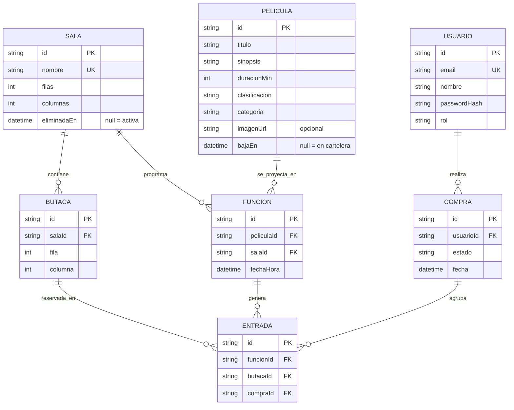

# Diagrama de entidades — Cinema MDW 2026

## Relaciones

- Un Usuario tiene muchas Compras asociadas.
- Una Sala tiene muchas Butacas asociadas.
- Una Sala tiene muchas Funciones asociadas.
- Una Película tiene muchas Funciones asociadas.
- Una Función tiene muchas Entradas asociadas.
- Una Butaca tiene muchas Entradas asociadas.
- Una Compra tiene muchas Entradas asociadas.